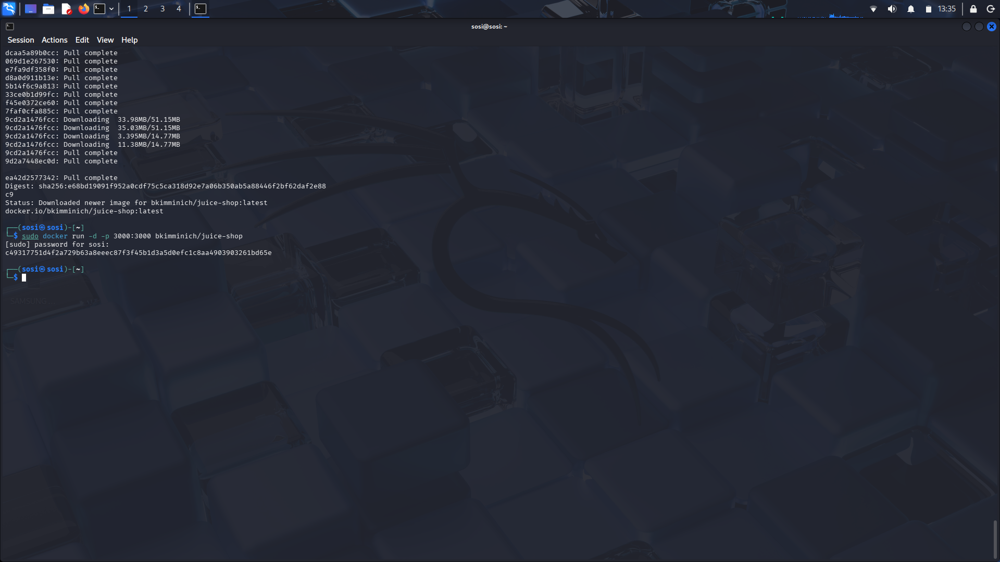
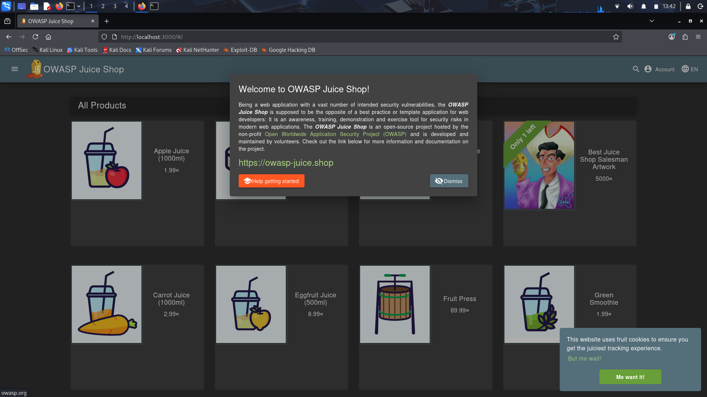
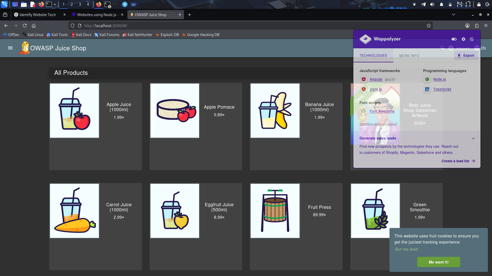
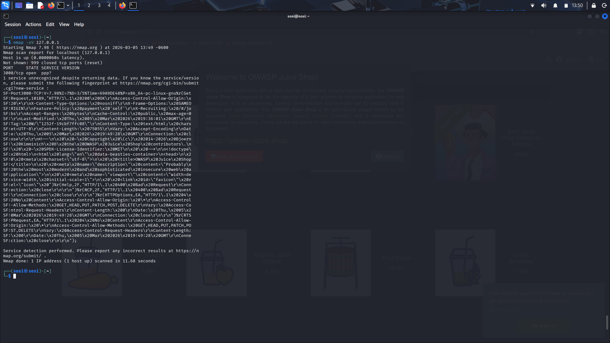
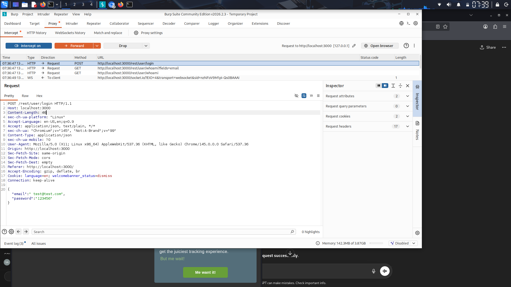
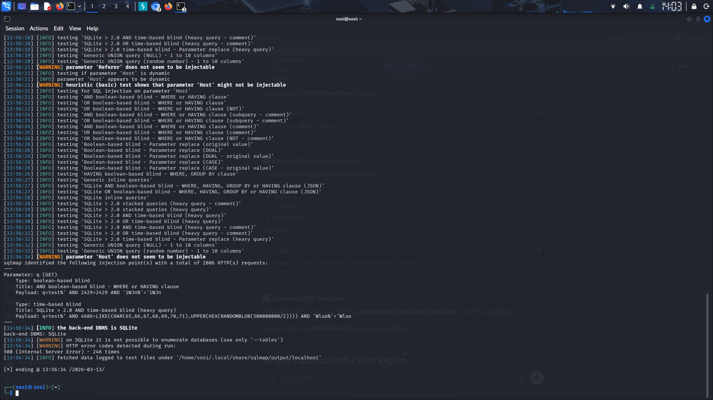

# Web Application Security Testing – OWASP Juice Shop

## Project Overview

This project demonstrates basic web application security testing using OWASP Juice Shop. The goal of the project is to identify common vulnerabilities in a web application using penetration testing tools.

OWASP Juice Shop is an intentionally vulnerable web application used for cybersecurity training.

---

# Tools Used

* Kali Linux
* OWASP Juice Shop
* Docker
* Nmap
* Burp Suite
* SQLmap
* Wappalyzer

---

# Project Steps

## 1. Setup OWASP Juice Shop

The vulnerable web application was deployed using Docker.

Command used:

docker pull bkimminich/juice-shop

docker run -d -p 3000:3000 bkimminich/juice-shop

The application was accessed through the browser:

http://localhost:3000

### Screenshot

---

## 2. Technology Identification

The Wappalyzer browser extension was used to identify the technologies used by the website.

Detected technologies:

* Node.js
* Express
* Angular
* SQLite

### Screenshot

---

## 3. Network Scanning

Nmap was used to identify open ports and services running on the system.

Command used:

nmap -sV localhost

### Screenshot

---

## 4. HTTP Request Interception

Burp Suite was used to intercept HTTP requests between the browser and the web application.

Steps performed:

1. Open Burp Suite
2. Enable Proxy Intercept
3. Open the Juice Shop website
4. Capture HTTP request

### Screenshot

---

## 5. SQL Injection Testing

SQLmap was used to test the web application for SQL Injection vulnerabilities.

Command used:

sqlmap -u "http://localhost:3000/rest/products/search?q=test" --dbs

The tool detected the backend database as SQLite and identified a vulnerable parameter.

### Screenshot

---

# Identified Vulnerabilities

## SQL Injection

SQL Injection vulnerability was detected in the search parameter which allows attackers to manipulate database queries.

## Broken Authentication

Authentication mechanisms may allow login bypass or unauthorized access.

## Sensitive Data Exposure

Sensitive data transmitted between client and server can be intercepted and analyzed.

---

# Conclusion

This project demonstrates how security testing tools can identify vulnerabilities in web applications. Practicing with OWASP Juice Shop helps cybersecurity students understand real-world web security issues.

---

# Author

Cybersecurity Student Project

